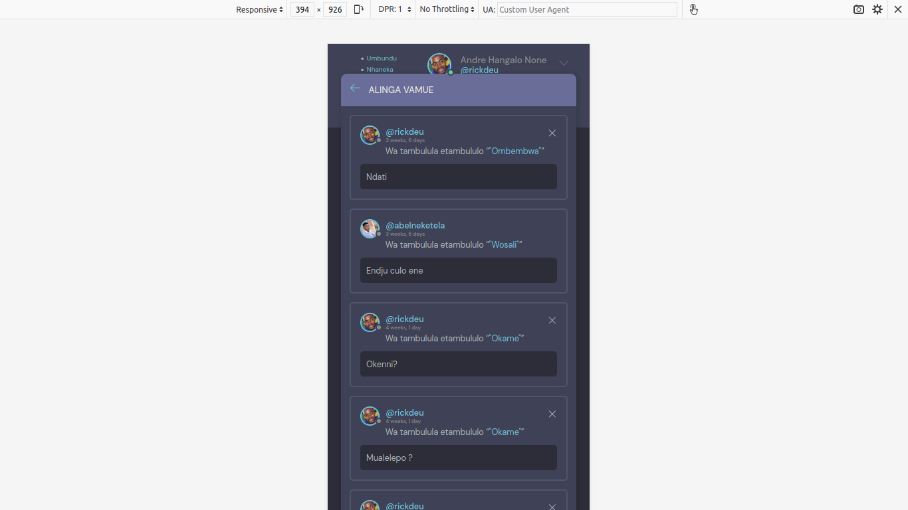

# Learn Angola Language (Otchotos)

##   Umbundu
##    Nhaneka
##    Kimbundo
##    Kikongo
##    Nganguela
##    Ibimbda

# Web application for creating chat rooms, the system is multilingual, with different Angolan national languages ​​(Umbundu, Nhaneka, Kimbundo, Kikongo, Nganguela, Ibimbda), the objective is to boost the use of national languages ​​in Angola

# 1. Download or Clone Project
###  pip install -r requirements.txt
  
  
# 1. HOME PAGE 

     

# 2. Chat Room

     

  
# 3. Profile 

     

# 3. Mobile (Responsive) Version 

     

     

